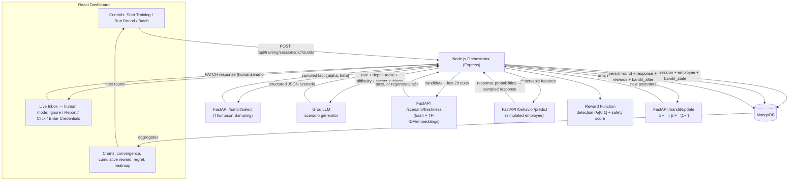

# SecureTrain — Adaptive AI Security Awareness Trainer

**Project blueprint (persisted design).** RL/Bandit agent adaptively selects phishing *tactics*, an LLM generates contextualized training scenarios, a simulated employee responds, and the response updates the agent's belief about that employee's weaknesses.

> Everything in this system is synthetic and local: simulated employees, simulated phishing content shown only inside the app, no real emails, no real credentials, no real targets.

---

## Decision Log

| # | Decision | Choice |
|---|----------|--------|
| 1 | Reward objective | **Design A**: detection signal drives the bandit; original safety mapping stored/reported only |
| 2 | Languages | TypeScript everywhere (frontend + backend) |
| 3 | Backend framework | Express + TypeScript (kept simple over NestJS) |
| 4 | Blueprint persistence | this document |
| 5 | Groq models | env-configurable split: `GROQ_MODEL_BULK` / `GROQ_MODEL_DEMO` |

---

## 1. Project Explanation

### Plain language
Generic security training treats everyone identically. An accountant may be nearly immune to "act now!" urgency but fall instantly for a fake invoice. This project builds an **adaptive diagnostic test**: each round the system picks one of four tactics, asks an LLM to write a realistic phishing email with that tactic tailored to the employee's role/department, records the reaction (Ignore / Report / Click / Enter credentials), and updates its belief about which tactic fools *this* person. Like adaptive testing (GRE-style) but locating a vulnerability instead of scoring a skill.

- **What the bandit learns:** which tactic most compromises each employee, in as few rounds as possible (per-employee belief).
- **What the LLM does:** writes varied scenario content. No memory of the game.
- **What the simulator does:** plays the victim from hidden susceptibility values.
- **What makes it adaptive:** round N's choice depends on all outcomes of rounds 1..N−1.

### Research framing
Stochastic multi-armed bandit (Beta-Bernoulli Thompson Sampling with fractional rewards) wrapped in an LLM content pipeline over a simulated human-response environment. Contribution: *sample-efficient personalization of security-training scenario selection via Thompson Sampling over LLM-generated, freshness-controlled scenarios, evaluated against random selection on a controlled population of simulated employees.*

## 2. System Components

| Component | Tech | Owns |
|---|---|---|
| Frontend | React + TS + Vite + Recharts | Visualization only: dashboards, live inbox UI, action buttons |
| Backend / Orchestrator | Node.js + Express + TS | The round loop: Python → LLM → Python → Mongo, REST API, persistence, session lifecycle |
| Database | MongoDB | Source of truth: employees, sessions, rounds/responses/rewards, bandit snapshots, analytics |
| AI/ML service | Python + FastAPI + scikit-learn | Stateless compute: bandit select/update, behavior model, freshness, metrics. Node passes state in/out |
| LLM | Groq API (`llama-3.1-8b-instant` bulk, `llama-3.3-70b-versatile` demo) | Scenario text generation only |

Deliberate choices: Python stays stateless (bandit state lives in Mongo); LLM is called from Node; prompts live in `prompts/` shared by both offline pool generation and online calls.

## 3. One Round, End to End

```text
POST /api/training/sessions/:id/rounds
 1. Orchestrator loads session + employee + bandit_state from MongoDB
 2. POST ai/bandit/select {arms:{...}}            -> sampled tactic (argmax Beta draw)
 3. Build LLM prompt: role, dept, tactic, difficulty, last N subjects
 4. Groq chat completion                          -> structured JSON scenario
 5. Validate schema + safety lint (banned domains, indicators present)
 6. Freshness check vs employee's last 20 scenarios -> regenerate if too similar (max 2x)
 7. Persist scenario doc
 8. Behavior step:
      simulated -> ai/behavior/predict -> sample categorical response
      human     -> render inbox; user clicks one of 4 actions; PATCH completes round
 9. Map response -> detection reward r in [0,1] (+ safety score stored)
10. POST ai/bandit/update {arm, r}                -> new alpha/beta
11. Persist round doc (response, rewards, posteriors after update)
12. Respond to frontend; charts update; next round
```

Idempotency by `round_no`: retries must never double-update the bandit.

## 4. Thompson Sampling

Beginner view: four slot machines with unknown payout tendencies. Keep a *belief distribution* per machine; each round imagine sampling one plausible payout per machine and pull the highest imaginary one. Unknown arms sometimes imagine high values → get explored. Consistently bad arms get pushed down → exploited less.

Formal: arms K = {urgency, authority, invoice, credential}; per employee e and arm k, latent θ(e,k). Posterior Beta(αk, βk), init Beta(1,1). Each round:

```text
θ̃k ~ Beta(αk, βk) ∀k;  k* = argmax θ̃k
observe reward rt ∈ [0,1]
αk* += rt ;  βk* += (1 − rt)
```

Fractional updates keep the posterior mean equal to the running average of observed rewards while variance produces exploration automatically.

### Correction to the original assumption (important)
The originally proposed mapping (Report +1 … Credentials −2) measures defensive *safety*. A bandit maximizing it learns to select the tactic the employee resists best and **stops probing the weak tactic** — the opposite of a trainer whose job is finding weakness. Therefore:

| Design | Bandit reward | Converges to | Use |
|---|---|---|---|
| **A (chosen)** | attack-success: cred 1.0, click 0.7, ignore 0.3, report 0.0 | weakest tactic | drives selection; "adaptive diagnostic" narrative |
| B (original) | report 1.0 … cred 0.0 | strongest tactic | kept as reported Safety Score only |

Both signals are stored per round; only A updates the bandit.

### Worked example (10 rounds)
Employee susceptibilities s = {.20, .30, .80, .40}. Response model (§5). True expected detection rewards: urgency 0.266, authority 0.339, **invoice 0.704**, credential 0.412. All arms start Beta(1,1).

| Rnd | Sampled θ (u/a/i/c) | Chosen | Outcome | r | Updated arm (α, β) → mean |
|----|---------------------|--------|---------|------|----------------------------|
| 1 | .41/.55/**.62**/.48 | invoice | click | .70 | inv (1.70, 1.30) → .567 |
| 2 | .38/.51/**.60**/.47 | invoice | cred | 1.00 | inv (2.70, 1.30) → .675 |
| 3 | .45/.49/**.64**/.58 | invoice | report | .00 | inv (2.70, 2.30) → .540 |
| 4 | .43/**.57**/.55/.52 | authority | ignore | .30 | auth (1.30, 1.70) → .433 |
| 5 | .36/.44/**.58**/.55 | invoice | cred | 1.00 | inv (3.70, 2.30) → .617 |
| 6 | .52/.41/**.61**/.49 | invoice | click | .70 | inv (4.40, 2.60) → .629 |
| 7 | .47/.46/**.60**/.56 | invoice | report | .00 | inv (4.40, 3.60) → .550 |
| 8 | .44/.43/**.59**/.57 | invoice | click | .70 | inv (5.10, 3.90) → .567 |
| 9 | .49/.45/.62/**.71** | credential | cred | 1.00 | cred (2.00, 1.00) → .667 |
| 10 | .49/.45/.63/**.68** | credential | click | .70 | cred (2.70, 1.30) → .675 |

Note rounds 9–10: credential *temporarily looks best* off two lucky draws — exactly why convergence claims need dozens of observations. Cumulative reward ≈ 6.10 vs 7.04 optimal-in-hindsight (regret ≈ 0.94) vs ≈ 4.30 expected random (regret ≈ 2.74).

Identification rule: argmax posterior mean stable ≥10 consecutive rounds with margin >0.05.

## 5. Employee Simulator

```json
{ "code": "emp_042", "role": "Accountant", "department": "Finance",
  "base_alertness": 0.55,
  "susceptibility": {"urgency": 0.20, "authority": 0.30, "invoice": 0.80, "credential": 0.40} }
```

Response model (`employee_simulator.py`):

```text
eff_s   = clip(s[tactic] · difficulty_factor(difficulty) · alertness_factor − training_boost, 0.02, 0.95)
P(cred) = 0.5 · eff_s
P(click)= 0.5 · eff_s
P(ignore) = (1 − eff_s) · (1 − 0.6·base_alertness)
P(report) = (1 − eff_s) − P(ignore)
difficulty_factor: 1..5 → [0.7 .. 1.25];  alertness_factor = 1.3 − 0.6·base_alertness
```

Population: 100 employees (5 roles × 5 departments × 4 variants). Each gets exactly one dominant weak arm (s ∈ [0.65, 0.90], others ≤ 0.45) so regret is well-defined. Susceptibility is **hidden ground truth**: never returned by agent-facing APIs; only the evaluation harness reads it.

This is a simulated environment, not a human-behavior predictor — stated in code, README, and paper.

## 6. Behavior Model Options

| Option | Verdict |
|---|---|
| A. Probabilistic simulator | MVP core — transparent, ground truth for regret (**built first**) |
| B. Multinomial Logistic Regression | Recommended ML layer (Stage 4): trained on ~20–50k simulator-generated interactions; features observable-only (one-hot tactic/difficulty/role/dept, history aggregates) |
| C. Random Forest | Skip — overkill, poor calibration |

LR fidelity vs oracle is reported (accuracy, confusion matrix, calibration). Circular disclosure: LR learns what the simulator teaches; the simulator remains the evaluation oracle.

## 7. LLM Scenario Generation

- Input payload: role, department, tactic, difficulty 1–5, fictional company name, last 10 subject lines, style seed.
- Output schema (enforced by pydantic/zod):

```json
{
  "tactic": "fake_invoice",
  "difficulty": 3,
  "sender_name": "Dana Whitfield",
  "sender_email": "billing@northwind-vendors.example.com",
  "subject": "Overdue invoice INV-20871 – service suspension Friday",
  "body": "...120–200 words...",
  "indicators": ["urgency deadline", "payment redirect request", "lookalike domain"],
  "hook": "threatens suspension of a service Finance depends on"
}
```

- Validation before storage: schema check → length bounds → banned-domain/keyword lint (`.example.com`/`.test` only; no real brands/people/URLs/payloads) → indicator presence → freshness check → fallback template mutation if LLM fails/rate-limits.
- Scaling tip: pre-generate pools offline per (role-category, tactic, difficulty) bucket; generate online only for demos/live mode.

## 8. Scenario Freshness

MVP: exact sha256 hash duplicate + TF-IDF cosine vs employee's last 20 scenarios; threshold **0.85**; regenerate ≤2× then accept best-of-three flagged `freshness_warning`.
Final: sentence embeddings (all-MiniLM-L6-v2, local), threshold 0.80. Report per-session diversity (mean pairwise similarity, unique-subject ratio).

## 9. Reward System

Stored per round:
- `reward.detection` = {credentials 1.0, click 0.7, ignore 0.3, report 0.0} — normalized [0,1], **drives the bandit** (Design A).
- `reward.safety` = {report 1.0, ignore 0.6, click 0.2, credentials 0.0} — original rubric, dashboard/paper metric only.

Ablation baseline: binary success TS (success = clicked or worse). Ignore is deliberately mid-valued (ambiguous signal).

## 10. RL Loop (pseudocode)

```text
function run_session(employee, n_rounds, selector):
    state ← load_or_init_bandit_state()          # α=β=1 ∀ arms
    history ← []
    for t in 1..n_rounds:
        arm ← selector.select(state)              # Θk~Beta(αk,βk); argmax
        scen ← llm_generate(context(employee, history), arm)   # template fallback
        scen ← validate(scen)
        if not fresh(scen, history): scen ← regenerate(max_tries=2)
        resp ← behavior_model.predict(...)        # or await human input
        r    ← map_reward_detection(resp)
        safe ← map_reward_safety(resp)
        state[arm] ← (α+r, β+(1−r))
        persist(round=t, arm, scen, resp, r, safe, posteriors_after)
    return summarize(state, history)

function evaluate(population, reps, selectors):
    for seed in 1..reps: for employee: for sel: run_session(...)
    compute cumulative reward, regret (true means known), %optimal-arm,
    discovery round, diversity metrics
```

Random selector runs the identical pipeline with uniform arm choice — isolating the policy as the only variable.

## 11. MongoDB Collections

Denormalized on purpose: response+rewards embedded in each round doc.

- **employees**: `_id, code, role, department, experience_years, base_alertness, susceptibility(hidden), created_at` · idx `{role, department}`
- **training_sessions**: `_id, employee_id, selector(thompson|random|epsilon_greedy), behavior_source(classifier|probabilistic|human), mode(evaluation|demo), status, config{n_rounds, difficulty_fixed, seed}, started_at, finished_at` · idx `{employee_id, status}`
- **scenarios**: `_id, session_id, round_no, tactic, difficulty, sender_name, sender_email, subject, body, indicators[], hook, content_hash, generation_source(llm|template), freshness{max_cosine, passed}, created_at` · idx `{content_hash}`, unique `{session_id, round_no}`
- **rounds**: `_id, session_id, employee_id, round_no, tactic_selected, scenario_id, response{response, probs, source}, reward{detection, safety}, bandit_after{}, created_at` · unique `{session_id, round_no}`
- **bandit_state**: `_id, session_id, arms{k:{alpha,beta,pulls}}, total_rounds, updated_at` · unique `{session_id}`
- **analytics**: materialized aggregates per session/employee/global (cumulative reward/regret curves, discovery_round, diversity, response counts)

`mode` quarantines live-demo data from paper data.

## 12. Backend API (Express)

| Method & Path | Purpose | Calls |
|---|---|---|
| POST `/api/employees` | create (auto-generates hidden susceptibility) | Mongo |
| GET `/api/employees` · GET `/:id` | list/profile (truth omitted unless `?include_truth=true`) | Mongo |
| POST `/api/training/sessions` | start `{employee_id, selector, behavior_source, mode, n_rounds, seed?}` | Mongo |
| POST `/api/training/sessions/:id/rounds` | run ONE round; human mode parks round `pending_human` | Python ×2, Groq, Mongo |
| PATCH `.../rounds/:n/response` | complete human round `{response}` | Python(update), Mongo |
| POST `.../run-batch` `{rounds}` | server-side sweep for eval harness | all |
| GET `.../export?format=jsonl|csv` | paper data dump | Mongo |
| GET `/api/employees/:id/vulnerability` | posterior-mean ranking across sessions | Mongo(+Python CI) |
| GET `/api/analytics/overview` | dashboard aggregates | Mongo |
| POST `/api/experiments` | register grid `{name, employees, rounds, reps, selectors[]}` | batch runner |
| POST `/api/demo/warm-start` `{rounds}` | pre-seed live-demo employee | Python, Groq(optional) |
| GET `/healthz` | liveness | all deps |

## 13. Python AI Service (stateless; Node owns persistence)

```
POST /bandit/select      {arms}                    -> {tactic, samples}
POST /bandit/update      {arm, reward∈[0,1]}       -> {alpha,beta,mean,var}
POST /behavior/predict   {features}                -> {probs, predicted}
POST /behavior/train     {dataset_path}            -> {metrics}
GET  /model/info                                   -> version, weights hash
POST /scenario/freshness {candidate, history}      -> {max_sim, passed}
POST /scenario/evaluate  {scenario_json}           -> {valid, issues[]}
POST /metrics/session    {rounds, true_means}      -> {regret_curve, discovery_round,...}
GET  /healthz
```

## 14. Frontend Screens

1 Employee list · 2 Vulnerability profile (radar/bar, optional reveal-truth) · 3 Training session (phase stepper, live posterior table) · 4 Generated scenario (email mock, SIMULATION banner, indicators) · 5 Response/result (predicted vs sampled, bandit delta) · 6 Bandit convergence (posterior means ± credible bands, discovery marker) · 7 Reward over time · 8 Tactic-selection distribution (stacked area) · 9 Scenario history table · 10 Overall analytics (the §16 graphs). Live mode adds 4 action buttons (Ignore/Report/Click/Enter credentials) with confirm dialogs; polling, no websockets.

## 15. Evaluation Design

- Population: 100 synthetic employees; rounds: 300 (main) / 500 (robustness); difficulty fixed at 3 so regret is well-defined.
- Conditions: Thompson Sampling vs Random (required); ε-greedy ε=.1 and binary-success TS (ablations).
- Repetitions: ≥20 seeds; all figures mean ±95% CI; paired by employee×seed.
- Metrics: cumulative reward; cumulative/per-round regret (true means known); %optimal-arm per round; discovery round (argmax stable ≥10 rounds, margin >0.05); ranking accuracy; diversity (mean pairwise cosine, unique-subject ratio); response distribution shift.
- Stats: Wilcoxon signed-rank on final cumulative reward; effect size; convergence medians ±IQR. Metric definitions pre-registered in `docs/EXPERIMENTS.md` before final runs.
- Expected: TS sublinear regret vs linear random; >90% optimal-arm rate by ~r100; discovery median ≈ 40–80 rounds.

## 16. Graphs

| # | Graph | X / Y | Proves |
|---|-------|-------|--------|
| 1 | Cumulative reward TS vs Random | round / Σ reward ±CI | adaptive selection wins after ~r20 |
| 2 | Regret curves | round / cum. regret | TS sublinear, Random linear |
| 3 | Arm-selection probability | round / P(select) stacked | exploration → exploitation shift |
| 4 | Discovery accuracy | round / % employees correctly identified | generalizes across population (S-curve >90%) |
| 5 | Scenario similarity histogram | pairwise cosine / density | freshness control works (mass <0.8) |
| 6 | Vulnerability heatmap | employees × tactics / estimated strength | per-employee personalization differs visibly |

## 17. Folder Structure (final — flat & obvious)

```text
SecureTrain/
├── ai-service/                  # Python brain (flat modules, name = job)
│   ├── bandit.py  reward.py  employee_simulator.py  classifier.py
│   ├── freshness.py  api.py  generate_scenarios.py  run_experiment.py
│   └── tests/
├── backend/                     # Node + Express + TS
│   ├── server.ts  config.ts  db.ts
│   ├── routes/{employees,training,analytics}.ts
│   └── services/{orchestrator,llm}.ts
├── frontend/src/
│   ├── App.tsx  api.ts
│   ├── screens/{Employees,Training,Analytics}.tsx
│   └── components/{ScenarioCard,ActionButtons,charts}.tsx
├── prompts/                     # LLM prompts + JSON schema + templates/ fallback
├── database/                    # init.js (indexes), seed.js (100 employees)
├── results/                     # experiment CSVs + figures
├── docs/                        # BLUEPRINT.md, ETHICS.md, EXPERIMENTS.md
├── .env.example  docker-compose.yml  README.md
```

## 18. Roadmap

- **Stage 1** Core loop, no servers: bandit + reward + probabilistic simulator + CLI demo *(this checkpoint)*
- **Stage 2** Offline evaluation script: TS vs random grid → CSV + graphs 1–4. Thesis proven before any plumbing.
- **Stage 3** LLM layer offline-first: prompts, schema/safety validation, freshness (hash+TF-IDF), template fallback, scenario pool generation. Online Node→Groq path lands in Stage 5 reusing these prompt files.
- **Stage 4** FastAPI endpoints + logistic-regression behavior model + fidelity metrics.
- **Stage 5** Mongo + Express CRUD/session/orchestrator/batch/export + full evaluation grid. Split 5a (API) / 5b (eval runs).
- **Stage 6** React dashboard (core screens → live-mode inbox + warm-start → analytics + docs + recording).

MVP = Stages 1–2. Demo-viable = +3a+4a+5a+6a/6b. Paper-complete = full grid + 5b + 6c.
Avoid regardless of time: deep RL (DQN etc.), LLM fine-tuning, real email sending, websockets, auth systems, Kubernetes, >4 tactics, human-subject studies.

## 19. Novelty — honest assessment

Interesting: closed-loop adaptive diagnosis with formal regret accounting applied to security-training personalization; freshness-controlled generative pipeline; computable ground-truth regret; the reward-objective design analysis (§4).
Common (do not claim): Thompson Sampling itself; phishing-sim platforms (GoPhish et al.); LLM-written phishing research; adaptive learning generally.
Contribution statement: *"An open, reproducible framework demonstrating Thompson-Sampling-based tactic selection identifies individualized vulnerability profiles with significantly fewer rounds than random selection, over a controlled population of synthetic employees, using LLM-generated freshness-controlled scenarios."*
Never claim: predicts real humans; beats commercial platforms; novel algorithm; improves real-world resilience.
Limitations to address pre-emptively: **circularity** (agent decodes a distribution we wrote — mitigation: relative claim A-vs-B under identical environment, observable-features-only learner, classifier-fidelity gap reported, human study as future work); no ecological validity; per-employee bandits don't naively scale (hierarchical priors = future work); LLM nondeterminism (pin model IDs, template mode, seeds).

## 20. Security & Ethics Boundaries

Structural guarantees: zero SMTP/email dependencies; `.example.com`/`.test` domains enforced by lint; banned-keyword list blocks real brands/URLs/attachment language; "Enter credentials" posts only to our own API; SIMULATION banner on every scenario surface; every doc carries `simulation: true`; sessions carry `mode: evaluation|demo`; susceptibility hidden from agent APIs; all data local; real names never sent to Groq. `docs/ETHICS.md` documents scope and non-goals. MIT license + responsible-use note.

## 21. Architecture Diagram



## 22. Deliverables

README (pitch, diagram, 3-command quickstart, GIF, honest limitations, ethics) · `make eval` regenerating every paper figure from raw export · pre-registered EXPERIMENTS.md · pinned versions · 90-second GIF + 3-minute recorded walkthrough (live segment narrated per §0 of discussion: warm-start disclosed, directional learning claimed, statistical claims reserved for simulator results) · seeded demo dataset.

## 23. What We Actually Build

1. First: brain in miniature — bandit + fake employees + rewards in pure Python, printing round tables.
2. Second: evaluation harness — 100 employees × hundreds of rounds × seeds → regret/convergence figures.
3. Third: flesh — Groq writes emails, validation + freshness, FastAPI + orchestrator + Mongo remember everything.
4. Final demo: pick an employee, watch rounds tick, see generated email, watch belief bars move; live mode lets you play the target.
5. "Start Training" creates a session; each round = select → generate → respond → reward → update → persist → display.
6. Expected: sublinear TS regret vs linear random; ~90%+ identification by ~100–150 rounds; discovery typically within 40–80.
7. Presentation: live adaptive demo + convergence visuals + regret chart + reward-design discussion + honest claims separation.
8. Paper claims (safe): sample-efficient personalization in a controlled simulated environment; significant improvement over random; reproducible open framework.

## Config Contract (.env.example)

```text
GROQ_API_KEY=
GROQ_MODEL_BULK=llama-3.1-8b-instant
GROQ_MODEL_DEMO=llama-3.3-70b-versatile
MONGO_URI=mongodb://localhost:27017
AI_SERVICE_URL=http://localhost:8000
BACKEND_PORT=4000
FRESHNESS_METHOD=tfidf        # tfidf | embedding (later)
FRESHNESS_THRESHOLD=0.85
```

## Module Build Order

ai-service: bandit → reward → employee_simulator → tests → run_experiment → generate_scenarios/freshness → classifier → api routers.
backend: db/indexes+seed → config/env → llm.ts → orchestrator.ts → routes (employees, training incl. batch/export/warm-start, analytics) → healthz.
frontend: api client + polling hook → screens Employees/Session/Analytics → components ScenarioCard/ActionButtons/charts.
infra/docs: docker-compose, prompts/, template library, BLUEPRINT/EXPERIMENTS/ETHICS docs, make-eval script.

Modules 1–4 (through run_experiment) alone constitute a defensible minimum project.
